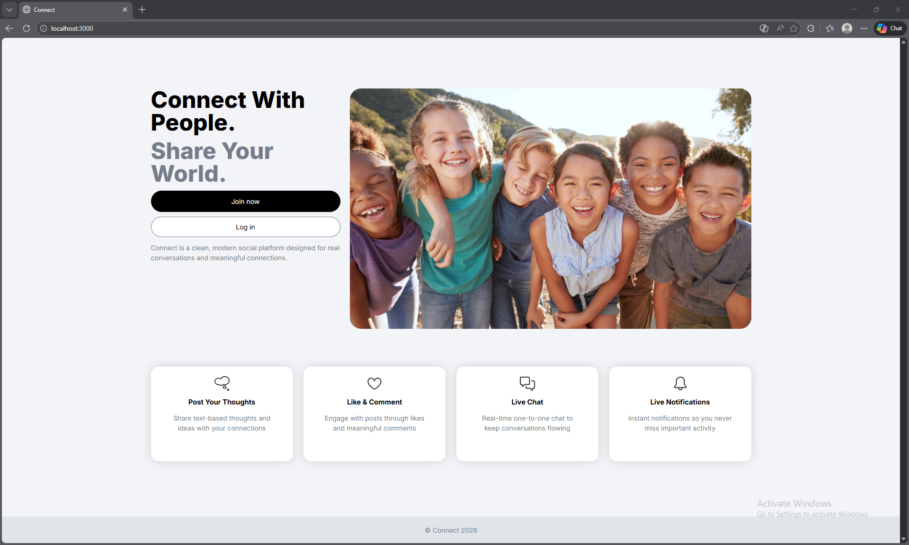
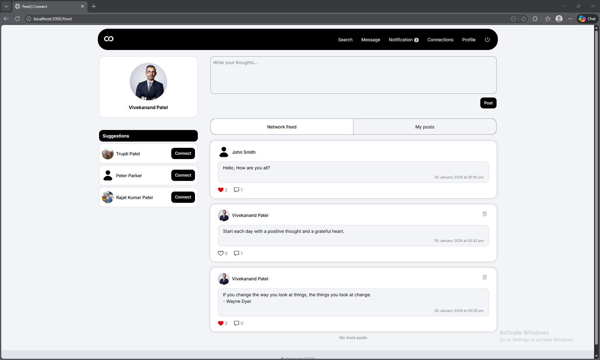
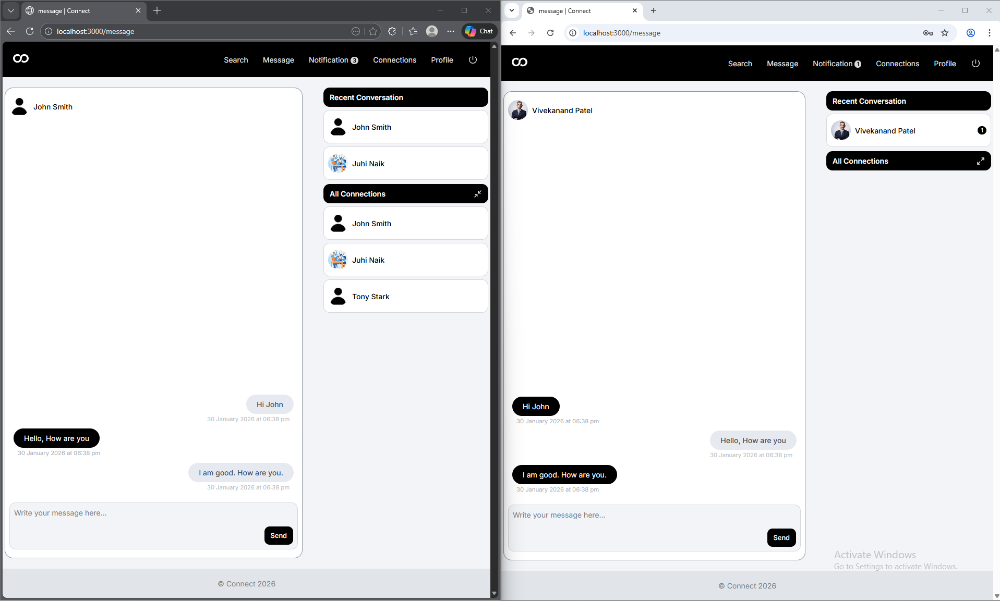
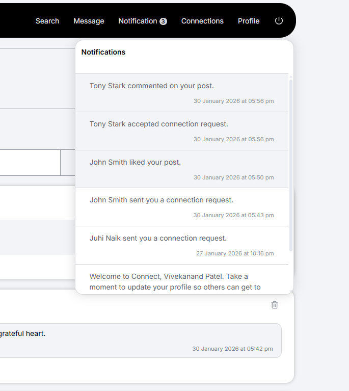
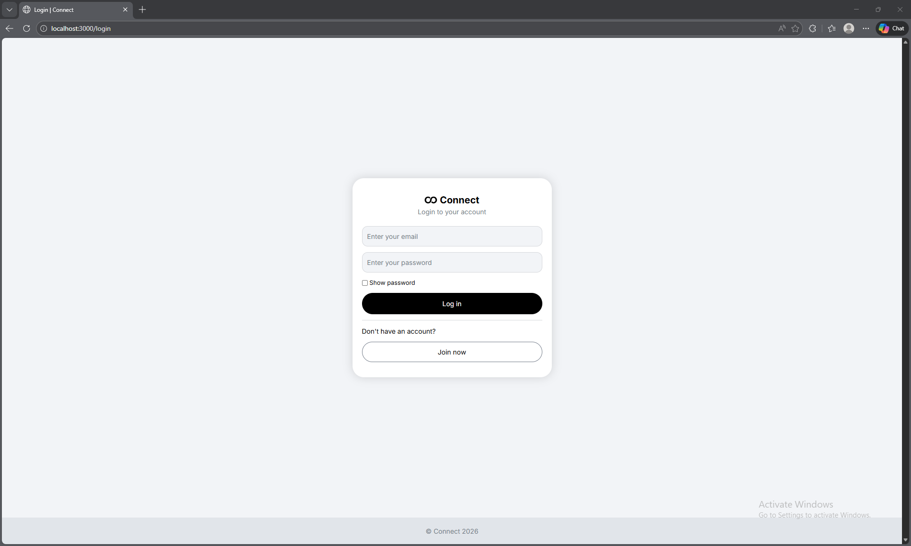
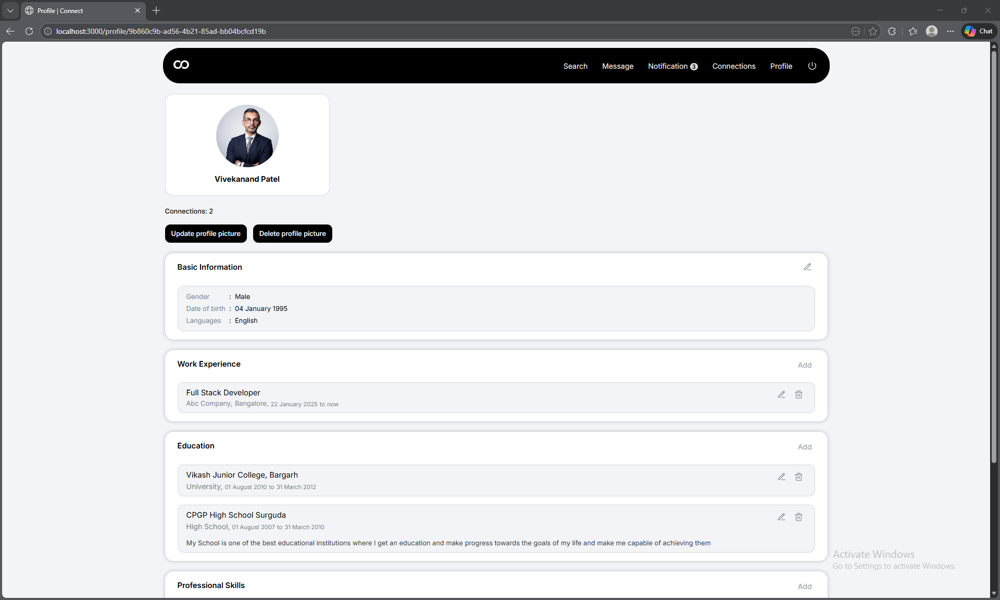

# Frontend – Connect

This repository contains the **frontend application** for **Connect**, a social media platform. The frontend is built using **Next.js with TypeScript and Tailwind CSS**, focusing on **performance, responsiveness, and real-time user experience**.

It integrates with a **microservices-based backend** and supports **real-time updates** for likes, comments, messages, and notifications.

---

## Tech Stack

- **Framework:** Next.js
- **Language:** TypeScript
- **Styling:** Tailwind CSS
- **Global UI State:** Redux Toolkit
- **Server State:** React Query
- **Real-Time Communication:** WebSocket
- **Input Validation:** Zod

---

## Application Routes

The application supports the following routes:

- `/` – Landing page
- `/login` – User login
- `/register` – User registration
- `/feed` – User feed
- `/profile/[id]` – User profile page
- `/connections` – User connections
- `/connections/requests/sent` – Sent connection requests
- `/connections/requests/received` – Received connection requests
- `/post/[id]` – Post details page
- `/message` – User-to-user messaging

---

## UI & Responsiveness

- Fully responsive UI
- Designed for:
    - Large screens (desktop)
    - Small screens (mobile)
- Layouts adapt based on screen size using Tailwind CSS utilities

---

## State Management Strategy

### Global Client State – Redux Toolkit

Redux Toolkit is used for **global and shared UI state**, such as:

- Active chat user information
- Global UI flags

Redux is intentionally **not used for server data** to avoid duplication.

---

### Server Data – React Query

React Query is used for **server-side data management**, including:

- Fetching feeds, posts, profiles, and connections
- Caching API responses
- Automatic re-fetching and invalidation after mutations

This keeps server data **consistent and performant**.

---

## Real-Time Updates

Real-time functionality is implemented using **WebSockets**.

### Supported Real-Time Features

- Likes
- Comments
- Notifications
- Messages

### Design Approach

- Initial data is fetched via **REST APIs**
- WebSocket is used only for **incremental real-time updates**
- Backend databases remain the **source of truth**
- Missed real-time events are recovered via re-fetching

---

## Input Validation

- User inputs are validated on the client using **Zod**
- Ensures:
    - Early feedback to users
    - Reduced invalid requests to backend services

---

## Setup and run locally

- Install node LTS version (I am using v24).
- First setup backend server. Instructions have been provided in the connect-server repo.
- Clone client files and folders from the connect-client repo.
- Create a `.env` file based on `.env.example`.
- Install dependencies using `npm install`.
- Run `npm run build` to build the application.
- Run `npm run start` to start the application.

## Screenshots

### Landing Page

### Feed (Posts, Likes, Comments)

### Real-Time Messaging

### Notifications (Real-Time)

More Screenshots

### Login

### Profile

